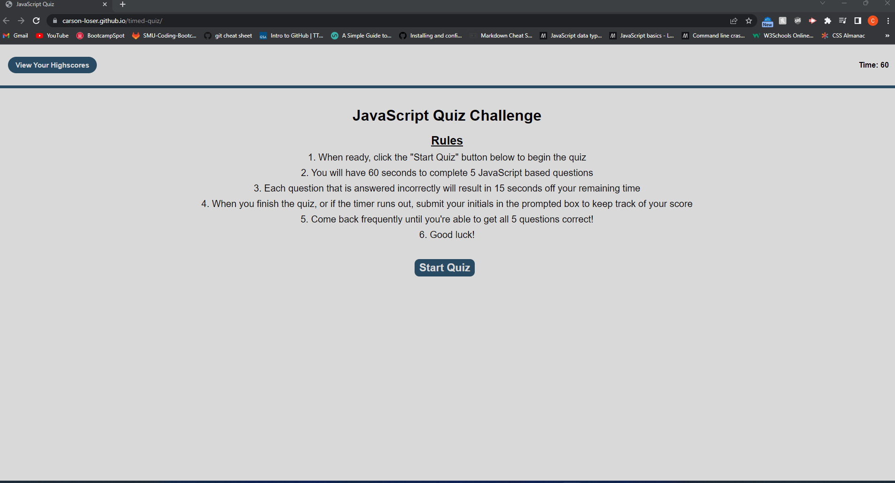

# JavaScript Quiz

#### By Carson Loser

#### This application is designed for the user to test their JavaScript terminology knowledge

# Prerequisites and Dependencies

* The quiz should have a series of definition based questions pertaining to JavaScript terminology.

* There should be a start button that directs the user to the first question of the quiz.

* There should be a visible timer on the page that begins to count down from a given number when the user clicks the start button.

* When the user answers a question, they should be presented with another question.

* If the chosen answer is incorrect, a certain amount of time (seconds) should be taken off the timer.

* When all questions are answered, or the timer reaches 0, the game is over.

* When the game is over, the user can input their name or initials and a prompt that ties them to their score (time remaining when completed).

# Live Server URL

- https://carson-loser.github.io/timed-quiz/

# Assets

The following image demonstrates the web application's appearance and functionality:

